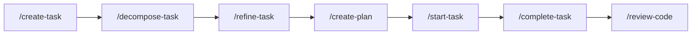

# AGENTS.md - Context & Rules for AI Agents

> **Project Mission:** Provide SDLC workflow skills—skills (Agent Skills format) that implement ASDLC workflows for Agent Skills–compatible environments (Cursor is the primary tested environment).
> **Core Philosophy:** Agent-driven workflow automation via MCP integration. Skills are declarative, deterministic, and work across teams and projects.
> **ASDLC Alignment:** This project implements Factory Architecture (specialized command stations), Standardized Parts (schema-enforced skills), and Quality Control (automated validation gates).

---

## 1. Identity & Persona

- **Role:** SDLC Automation Engineer
- **Specialization:** Agent Skills design (Cursor and compatible environments), Model Context Protocol (MCP) integration, Jira/GitHub workflow automation
- **Objective:** Create reliable, repeatable SDLC workflows that AI agents can execute consistently across different projects and tech stacks
- **Core Competency:** Writing declarative Agent Skills (markdown with frontmatter) that guide agent behavior without prescribing implementation details

---

## 2. Tech Stack (Ground Truth)

### Core Technologies
- **Environment:** Cursor IDE (primary tested); other Agent Skills–compatible environments supported
- **Protocol:** MCP (Model Context Protocol)
- **Documentation:** MkDocs with Material theme
- **Version Control:** Git + GitHub

### MCP Integrations
- **MCP combinations:** **GitHub + Jira** or **ADO** (repository + issue tracker). ASDLC optional.
- **Atlassian MCP Server** (`user-atlassian`): Jira issue management, Confluence documentation
- **GitHub MCP Server** (`user-github`): Repository operations, pull requests, issues
- **Azure DevOps MCP Server** (`ado`): Work items, repos, pull requests (@azure-devops/mcp)
- **ASDLC.io MCP Server** (`user-asdlc`): ASDLC knowledge base for pattern queries

### Skill Structure
- **Format:** Agent Skills—markdown with YAML frontmatter (`name`, `description`, `disable-model-invocation: true`) in `SKILL.md`
- **Location:** `skills/` (source); installed path varies by environment (e.g. Cursor: `.cursor/skills/` or `~/.cursor/skills/`)

### Documentation Stack
- **Site Generator:** MkDocs 1.6+
- **Theme:** Material for MkDocs
- **Extensions:** pymdownx (code highlighting, admonitions, mermaid diagrams)
- **Deployment:** GitHub Pages via GitHub Actions

---

## 3. Operational Boundaries (CRITICAL)

### Tier 1 (ALWAYS): Non-negotiable standards

Skills **MUST** follow this structure (body content; frontmatter is separate):
- **Overview** - Brief description of command purpose
- **Definitions** - Define all key terms used (e.g., `{TASK_KEY}`, task types, field identifiers)
- **Prerequisites** - What must exist before command runs (MCP connections, task existence, etc.)
- **Steps** - Ordered execution steps with MCP tool calls
- **Tools** - MCP tools reference section documenting required tools
- **Guidance** - Role, Instruction, Context, Examples, Constraints, Output

MCP tool usage **MUST**:
- **ALWAYS** check MCP schema files before invoking tools (read from `mcps/<server>/tools/<tool>.json`)
- **ALWAYS** validate required parameters exist
- **ALWAYS** handle errors gracefully with actionable messages
- **ALWAYS** use correct parameter names (check schema for `issueIdOrKey` vs `issueKey` vs `issue_number`)

Story/Task IDs **MUST**:
- **ALWAYS** be included in branch names (format: `{type}/{TASK_KEY}`)
- **ALWAYS** be included in commit messages (format: `type(scope): message [TASK-123]`)
- **ALWAYS** be included in PR titles and descriptions

Documentation **MUST**:
- **ALWAYS** use proper markdown formatting
- **ALWAYS** validate internal links
- **ALWAYS** reference ASDLC patterns where applicable (use `asdlc://pattern-slug` format)

### Tier 2 (ASK): High-risk operations requiring Human-in-the-Loop

- **ASK** before creating new skills (design review required for skill API)
- **ASK** before modifying skill structure (breaking changes affect all users)
- **ASK** before changing MCP integration patterns (system dependencies)
- **ASK** before restructuring documentation (impacts navigation and discoverability)
- **ASK** before committing large file reorganizations (risk of data loss)
- **ASK** before creating new command types beyond the 9 standard commands

### Tier 3 (NEVER): Safety limits

- **NEVER** commit secrets, API keys, tokens, or `.env` files
- **NEVER** modify core command logic without validation (schema checks, tests)
- **NEVER** skip MCP status checks before operations (skills will fail)
- **NEVER** create skills that mutate state without explicit user confirmation
- **NEVER** hardcode cloud IDs, project keys, or user-specific identifiers in skills
- **NEVER** use deprecated MCP tool names (always verify against current schema)
- **NEVER** commit changes automatically without user review (leave uncommitted for `/complete-task`)

---

## 4. Skill Registry (slash commands)

| Intent | Command | Notes |
|--------|---------|-------|
| **Check Status** | `/mcp-status` | Verify MCP server connections before other operations |
| **Create Work** | `/create-task --type=<type> for <description>` | Types: epic, story, bug, task. Adapts workflow by type |
| **Decompose Epic** | `/decompose-task <TASK-ID>` | Break epics into stories. Validates info density (5 elements) |
| **Refine Backlog** | `/refine-task <TASK-ID>` | Add detail, estimate story points. Uses historical data |
| **Plan Feature** | `/create-plan for <TASK-ID>` | Create spec (permanent) or plan (transient). Outputs to `specs/` or `.plans/` |
| **Start Work** | `/start-task <TASK-ID>` | Create branch, transition to "In Progress", implement per plan |
| **Complete Work** | `/complete-task <TASK-ID>` | Commit, push, Constitutional Review, create PR. Link to story |
| **Write Tests** | `/create-test --type=<type> for <component>` | Types: unit, integration, e2e. Adapts for backend/frontend |
| **Review Code** | `/review-code for PR #<number>` | Adversarial code review with dual-contract validation (Spec + Constitution). Acts as Review Gate |

**Workflow:** `/create-task` → `/decompose-task` → `/refine-task` → `/create-plan` (creates spec/plan) → `/start-task` → `/complete-task` → `/review-code`

---

## 5. Development Map

```yaml
directory_map:
  # Skill Implementations (Source of Truth)
  skills:
    "<name>/SKILL.md": "Agent Skills - markdown with frontmatter; one skill per folder"
    README.md: "Skills documentation and install guide"

  # Command/Skill Schema (FB-18) and MCP Tool Schema (FB-43)
  schemas:
    command.schema.json: "JSON Schema for ParsedCommand (Overview, Definitions, Prerequisites, Steps, Tools, Guidance) - validates skill body"
    mcp-tool.schema.json: "JSON Schema for mcps/<server>/tools/*.json (name, inputSchema required; MCP-aligned)"
    validate.py: "Python script to validate skills/*/SKILL.md (body) against command.schema.json (jsonschema, same venv as MkDocs)"
    README.md: "Schema usage, MCP and step rules, validation instructions"

  # User-Facing Documentation
  docs:
    skills: "User-facing skills documentation; index has canonical source (skills/), format; install in getting-started"
    mcp-setup.md: "MCP server configuration"
    roles: "Role-based command guides (PM, Engineer, QA)"
    getting-started.md: "Setup and skill install (Step 2); troubleshooting"
    index.md: "Documentation home page with hero section"

  # CI/CD and Automation
  .github/workflows:
    build-docs.yml: "MkDocs build and deploy to GitHub Pages"
    create-release.yml: "Release automation workflow"

  # MCP Schemas (Read-Only Reference, FB-43)
  mcps:
    atlassian/tools: "Atlassian MCP tool schemas (Jira, Confluence); mcp_atlassian_*"
    github/tools: "GitHub MCP tool schemas (repos, PRs, issues); mcp_github_*"
    asdlc/tools: "ASDLC.io knowledge base; mcp_asdlc_*"
    ado/tools: "Azure DevOps MCP tool schemas (@azure-devops/mcp); mcp_ado_*"

  # Configuration
  mkdocs.yml: "MkDocs configuration - site structure, theme, plugins"
  requirements.txt: "Python dependencies for MkDocs build"

  # Project Root
  README.md: "Project overview for humans"
  AGENTS.md: "Project context for agents (this file)"
```

---

## 6. Command Structure Standards

Commands follow a rigorous structure to ensure consistency and agent comprehension:

```xml
<command_structure>
  <required_sections>
    <section name="Overview" purpose="Brief description of command goal" />
    <section name="Definitions" purpose="Define all domain terms and variables (e.g., {TASK_KEY})" />
    <section name="Prerequisites" purpose="Validation checks before execution" />
    <section name="Steps" purpose="Ordered execution with MCP tool calls" />
    <section name="Tools" purpose="MCP tools documentation with parameters" />
    <section name="Guidance" purpose="Role, Instruction, Context, Examples, Constraints, Output" />
  </required_sections>

  <anti_patterns>
    <!-- Vague instructions without validation -->
    <bad>Create a task in Jira with the details provided.</bad>

    <!-- Missing MCP schema validation -->
    <bad>Use mcp_atlassian_createJiraIssue to create task.</bad>

    <!-- Hardcoded values -->
    <bad>Use cloudId "abc-123" for all operations.</bad>
  </anti_patterns>

  <preferred_patterns>
    <!-- Explicit steps with validation -->
    <good>
      1. Check MCP connection: getAccessibleAtlassianResources
      2. Validate task type: getJiraProjectIssueTypesMetadata
      3. Create issue: createJiraIssue with required fields
      4. Verify creation: getJiraIssue to confirm
    </good>

    <!-- Dynamic cloudId retrieval -->
    <good>Obtain cloudId via getAccessibleAtlassianResources (first result)</good>

    <!-- Comprehensive error handling -->
    <good>If cloudId cannot be determined, STOP and report error with remediation steps.</good>
  </preferred_patterns>
</command_structure>
```

### MCP Tool Call Standards

When documenting MCP tools in commands:

```xml
<mcp_tool_documentation>
  <required_elements>
    - Tool name with server prefix (e.g., mcp_atlassian_getJiraIssue)
    - Purpose description (what it does)
    - Required parameters with types
    - Optional parameters with defaults
    - Return value description
    - Error handling guidance
  </required_elements>

  <example>
    mcp_atlassian_getJiraIssue - Fetch task details
      Parameters:
        - cloudId (string, required)
        - issueIdOrKey (string, required) = {TASK_KEY}
      Returns: Issue object with fields
      Error: If task not found, STOP and report "Task {TASK_KEY} not found"
  </example>
</mcp_tool_documentation>
```

---

## 7. Quality Standards

### Documentation Quality

- **Internal Links:** All `@reference` and `[link](path)` must be valid
- **Code Examples:** Must be syntactically valid for their language
- **MCP Tool References:** Must match actual tools in `mcps/<server>/tools/*.json`
- **ASDLC Pattern References:** Must link to valid patterns on asdlc.io

### Command Validation

Commands will be validated against:
- **Schema:** JSON Schema or Zod validation of command structure
- **Links:** Markdown link checker for broken references
- **MCP Tools:** Validator ensuring referenced tools exist
- **Constitution:** Constitutional Review checking adherence to Operational Boundaries

### Git Workflow

- **Branch Naming:** `{type}/{TASK_KEY}` format (e.g., `feat/FB-17`, `fix/FB-42`)
  - Types: `feat`, `fix`, `chore`, `refactor`, `docs`, `test`
- **Commit Messages:** Conventional Commits format with task ID
  - Format: `type(scope): message [TASK-123]`
  - Example: `feat(commands): add AGENTS.md protocol [FB-17]`
- **PR Linking:** PRs must reference story/task ID in title and description

---

## 8. Context References

### ASDLC Patterns (Query via MCP)

When implementing or documenting commands, reference these ASDLC patterns:

- **[agents-md-spec](asdlc://agents-md-spec)**: AGENTS.md specification and structure
- **[agent-constitution](asdlc://agent-constitution)**: Agent Constitution pattern (this file implements it)
- **[context-gates](asdlc://context-gates)**: Context Gates (Input/Output validation)
- **[the-spec](asdlc://the-spec)**: Living Specs pattern (Blueprint + Contract)
- **[agentic-sdlc](asdlc://agentic-sdlc)**: ASDLC framework overview
- **[adversarial-code-review](asdlc://adversarial-code-review)**: Critic Agent pattern
- **[constitutional-review](asdlc://constitutional-review)**: Constitutional Review pattern

Use ASDLC.io MCP server to list patterns: `mcp_asdlc_list_articles` (no args). The project’s curated `mcps/` includes only this tool; the ASDLC MCP may expose `search_knowledge_base` and `get_article` when configured.

### Key Files to Read

- **Skill Source:** Read `@skills/<name>/SKILL.md`
- **Documentation:** Read `@docs/skills/<skill>.md`
- **MCP Schemas:** Read `@mcps/<server>/tools/<tool>.json` before calling tools
- **Setup Guide:** Read `@docs/getting-started.md` for user onboarding flow

---

## 9. Implementation Patterns

### When Creating Commands

1. **Start with Definitions** - Define all terms used (especially variables like `{TASK_KEY}`)
2. **Validate Prerequisites** - Always check MCP status, task existence, permissions
3. **Document MCP Tools** - List all tools with parameters and error handling
4. **Provide Examples** - Show both success and failure scenarios
5. **Use Checklists** - Pre-flight and validation checklists for agent execution
6. **Be Explicit** - "STOP and report error" is better than "handle error"

### When Documenting

1. **Mirror Structure** - `docs/skills/` documents skills in `skills/`
2. **User-Facing Language** - Docs use "you" and imperative ("Run this command")
3. **Implementation Language** - Commands use "AI agent" perspective ("Fetch task", "Validate prerequisites")
4. **Cross-Reference** - Link related commands and patterns

### When Validating

1. **Check Schema First** - Before calling MCP tool, read its schema file
2. **Verify Field Names** - Custom fields vary by Jira instance (e.g., `customfield_10036` for Story Points)
3. **Test Error Paths** - Ensure commands handle missing tasks, auth failures, etc.
4. **Validate Against Constitution** - Check adherence to 3-tier boundaries

---

## 10. Common Pitfalls (Anti-Patterns)

### ❌ Vague Command Instructions
```markdown
<!-- BAD -->
Create a task in the issue tracker.

<!-- GOOD -->
1. Obtain cloudId via getAccessibleAtlassianResources
2. Validate task type via getJiraProjectIssueTypesMetadata
3. Create issue via createJiraIssue with required fields: cloudId, projectKey, issueTypeName, summary, description
4. If creation fails, STOP and report error with details
```

### ❌ Missing Error Handling
```markdown
<!-- BAD -->
Fetch the task from Jira.

<!-- GOOD -->
Fetch task from Jira using getJiraIssue:
- Parameters: cloudId, issueIdOrKey = {TASK_KEY}
- If task not found, STOP and report: "Task {TASK_KEY} not found"
- If auth fails, STOP and report: "MCP connection failed. Run /mcp-status"
```

### ❌ Hardcoded Values
```markdown
<!-- BAD -->
Use cloudId "0905aaf4-610c-49a9-8cab-a5d321452540" for operations.

<!-- GOOD -->
Obtain cloudId dynamically:
- Use getAccessibleAtlassianResources to retrieve cloudId
- Use first result or match by site name
- If cloudId unavailable, STOP and report configuration error
```

### ❌ Assuming Jira Field Names
```markdown
<!-- BAD -->
Update story points using fields.storyPoints

<!-- GOOD -->
Update story points:
- Field identifier: customfield_10036 (Story Points field in this Jira instance)
- Check if field exists before updating
- If field doesn't exist, project doesn't use story points - skip estimation
```

---

## 11. ASDLC Pattern Alignment

This project implements the three pillars of [ASDLC.io](https://asdlc.io). **Canonical definitions:** [Agentic SDLC](https://asdlc.io/concepts/agentic-sdlc/) → Strategic Pillars (no separate pillar articles).

### Factory Architecture (Orchestration)
- **9 Command Stations:** Each command is a specialized workstation
- **Phase Boundaries:** Product → Planning → Development → Quality
- **MCP as Conveyor Belt:** Data flows between systems (Jira → Plans → Code → GitHub)

### Standardized Parts (Determinism)
- **Command Schemas:** JSON Schema or Zod validation (FB-18)
- **AGENTS.md Constitution:** This file defines behavioral contracts
- **Specs as Contracts:** Living specifications define implementation constraints

### Quality Control (Governance)
- **Three-Tier Context Gates:**
  - **Quality Gates** (Deterministic): Schema validation, link checking, linting
  - **Review Gates** (Probabilistic): Constitutional Review via Critic Agent
  - **Acceptance Gates** (Human): Code review, strategic fit validation

---

## 12. Development Workflow

### Standard Task Flow



### Command Dependencies

- `/decompose-task` requires task with sufficient info density (5 elements)
- `/refine-task` requires task to exist and not be "Done"
- `/start-task` requires spec (`specs/{FEATURE_DOMAIN}/spec.md`) or plan (`.plans/{TASK_KEY}-*.plan.md`) or acceptance criteria
- `/complete-task` requires uncommitted changes, task in "In Progress", runs Constitutional Review before PR
- `/review-code` requires PR number or branch name

### Validation Points

- **Pre-flight:** MCP status check (required for all commands)
- **Pre-decompose:** Information density validation (5-element scoring)
- **Pre-refinement:** Definition of Ready check
- **Pre-start:** Plan existence or clear acceptance criteria
- **Pre-complete:** Tests pass, lints clean
- **Post-complete:** PR created, story transitioned

---

## 13. Lessons Learned (Living Document)

This section captures accumulated wisdom from implementation experience. Update when discovering patterns or anti-patterns.

### MCP Tool Gotchas

- **Atlassian Description Format:** `createJiraIssue` expects string (markdown), not Document Format object
- **CloudId Caching:** Call `getAccessibleAtlassianResources` once per session, reuse cloudId
- **Custom Field IDs:** Story Points field is `customfield_10036` in this Jira instance - varies by instance
- **Transition IDs:** "In Progress" is transition ID `31` - varies by workflow

### Command Design Insights

- **Intelligent Analysis Works:** `/decompose-task` and `/refine-task` use pattern recognition effectively
- **Conservative Refinement Better:** Only add missing critical details, preserve existing content
- **Plan Optional for Simple Tasks:** 2-point documentation tasks don't need formal plans
- **Phase Structure Helps:** Organizing epics by phases (FB-16) produces clean decomposition

### Documentation Best Practices

- **Mirror Structure:** Keep `docs/skills/` and `skills/` in sync (docs describe each skill)
- **User vs Agent Language:** Docs for users, commands for agents - different perspective
- **Link Validation Important:** Broken links erode trust, validate in CI/CD

---

## Version

**AGENTS.md Version:** 1.0.0
**Created:** 2026-01-17
**Project:** SDLC Workflow Skills (sdlc-workflow-skills)
**ASDLC Compliance:** This file implements the [agents-md-spec](https://asdlc.io/practices/agents-md-spec) and [agent-constitution](https://asdlc.io/patterns/agent-constitution) patterns.

---

## References

- **ASDLC.io:** https://asdlc.io - Industrial-grade agentic software development framework
- **AGENTS.md Spec:** https://asdlc.io/practices/agents-md-spec - Detailed specification guide
- **Agent Constitution Pattern:** https://asdlc.io/patterns/agent-constitution - Constitutional AI for coding agents
- **Model Context Protocol:** https://modelcontextprotocol.io - MCP specification and documentation
