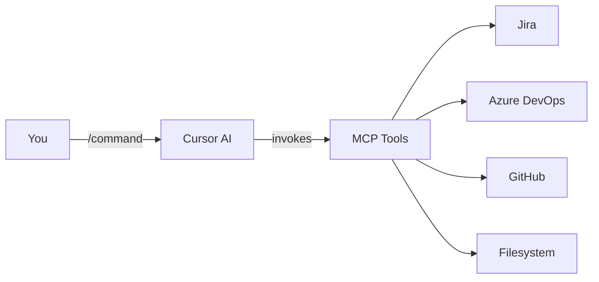

  <h1>Agentic Software Development</h1>
  
Standardize your SDLC with natural language commands. Built for Cursor IDE and MCP tools. Works with Jira, Azure DevOps, and GitHub.

  

    <a href="getting-started/" class="md-button md-button--primary">Get Started</a>
    <a href="commands/" class="md-button">View Commands</a>
    <a href="https://github.com/fancybread-com/agentic-software-development" class="md-button">GitHub</a>
  

---

## What This Is

A standardized approach to Software Development Lifecycle operations using well-defined, organized commands that work across teams and projects.

**Built on:**

- **Cursor IDE** - AI-powered development environment
- **MCP (Model Context Protocol)** - Connects to Jira, Azure DevOps, GitHub
- **Natural language commands** - Markdown instructions for AI agents

---

## How It Works

**Flow:**

1. **You invoke a command** (e.g., `/start-task PROJ-123`)
2. **Cursor AI reads the command** (markdown instruction file)
3. **AI invokes MCP tools** to interact with:
   - **Jira** - Issue tracking and project management
   - **Azure DevOps** - Work items and boards
   - **GitHub** - Repository and pull requests
   - **Filesystem** - Plans and code
4. **AI executes contextually** based on your project

**Result:** Consistent operations regardless of project, tech stack, or team.

---

## Find Your Commands

-   **Product Manager**

    Create and prioritize features

    [:octicons-arrow-right-24: View](roles/product-manager.md)

-   **Software Engineer**

    Development and quality

    [:octicons-arrow-right-24: View](roles/engineer.md)

-   **QA Engineer**

    Testing and verification

    [:octicons-arrow-right-24: View](roles/qa.md)

[:octicons-person-24: View by Role](commands/by-role.md){ .md-button }
[:octicons-zap-24: Quick Reference](commands/quick-reference.md){ .md-button }

---

## Getting Started

### 1. Setup MCP Connections

Connect Cursor to your services (Jira, Azure DevOps, GitHub, filesystem).

### 2. Install Commands

Add command library to your Cursor workspace.

### 3. Start Using

Invoke your first command: `/create-task --type=story for [your feature]`

[:octicons-arrow-right-24: Full Setup Guide](getting-started.md){ .md-button .md-button--primary }

---

## Learn More

- **[Commands Reference](commands/index.md)** - All 8 commands with previews
- **[Role Guides](roles/index.md)** - Commands organized by role
- **[How It Works](getting-started.md#how-it-works)** - Core principles
- **[Setup Instructions](implementations/cursor/mcp-setup.md)** - Detailed configuration
