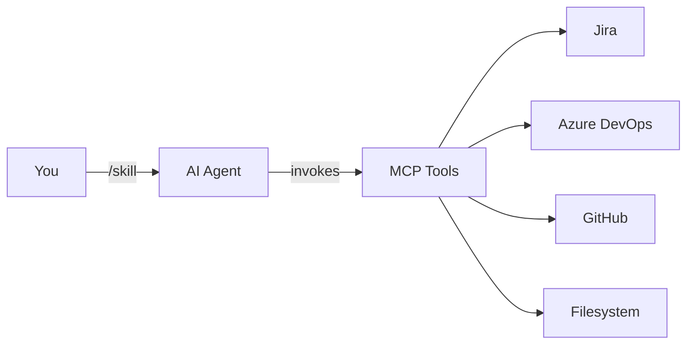

  <h1>SDLC Workflow Skills</h1>
  
SDLC workflow skills (Agent Skills format) that implement ASDLC workflows. Works in any Agent Skills–compatible environment (including Cursor) with MCP. Jira, Azure DevOps, and GitHub.

  

    <a href="getting-started/" class="md-button md-button--primary">Get Started</a>
    <a href="skills/" class="md-button">View Skills</a>
    <a href="https://github.com/fancy-bread/sdlc-workflow-skills" class="md-button">GitHub</a>
  

---

## What This Is

SDLC Workflow Skills provides skills in Agent Skills format that implement ASDLC workflows. They work across teams and projects in any environment that supports Agent Skills (Cursor IDE is the primary tested environment).

**Built on:**

- **Agent Skills** – Markdown instructions with frontmatter (Cursor and other compatible environments)
- **MCP (Model Context Protocol)** – Connects to Jira, Azure DevOps, GitHub
- **ASDLC** – Principles for industrial-grade agentic software development

---

## How It Works

**Flow:**

1. **You invoke a skill** (e.g. `/start-task PROJ-123`)
2. **Your AI agent reads the skill** (markdown instruction file)
3. **AI invokes MCP tools** to interact with:
   - **Jira** - Issue tracking and project management
   - **Azure DevOps** - Work items and boards
   - **GitHub** - Repository and pull requests
   - **Filesystem** - Plans and code
4. **AI executes contextually** based on your project

**Result:** Consistent operations regardless of project, tech stack, or team.

---

[:octicons-zap-24: Quick Reference](skills/quick-reference.md){ .md-button }

---

## Getting Started

### 1. Setup MCP Connections

Connect your IDE or agent to your services (Jira, Azure DevOps, GitHub, filesystem). In Cursor: Settings → Features → Model Context Protocol.

### 2. Install Skills

Recommended: `npx skills add fancy-bread/sdlc-workflow-skills -a cursor` (choose **Copy** for Cursor). Or copy into your environment’s skills directory (e.g. Cursor: `~/.cursor/skills/` or `.cursor/skills/`). See [Getting Started](getting-started.md#step-2-install-skills).

### 3. Start Using

Invoke your first skill: `/create-task --type=story for [your feature]`

[:octicons-arrow-right-24: Full Setup Guide](getting-started.md){ .md-button .md-button--primary }

---

## Learn More

- **[Skills Reference](skills/index.md)** - All skills with previews
- **[How It Works](getting-started.md#how-it-works)** - Core principles
- **[Setup Instructions](mcp-setup.md)** - Detailed configuration
